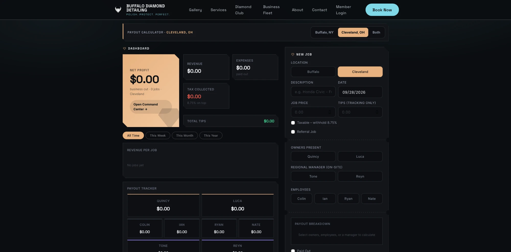
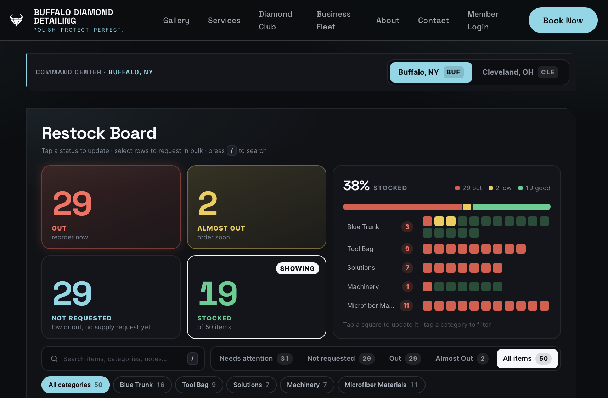
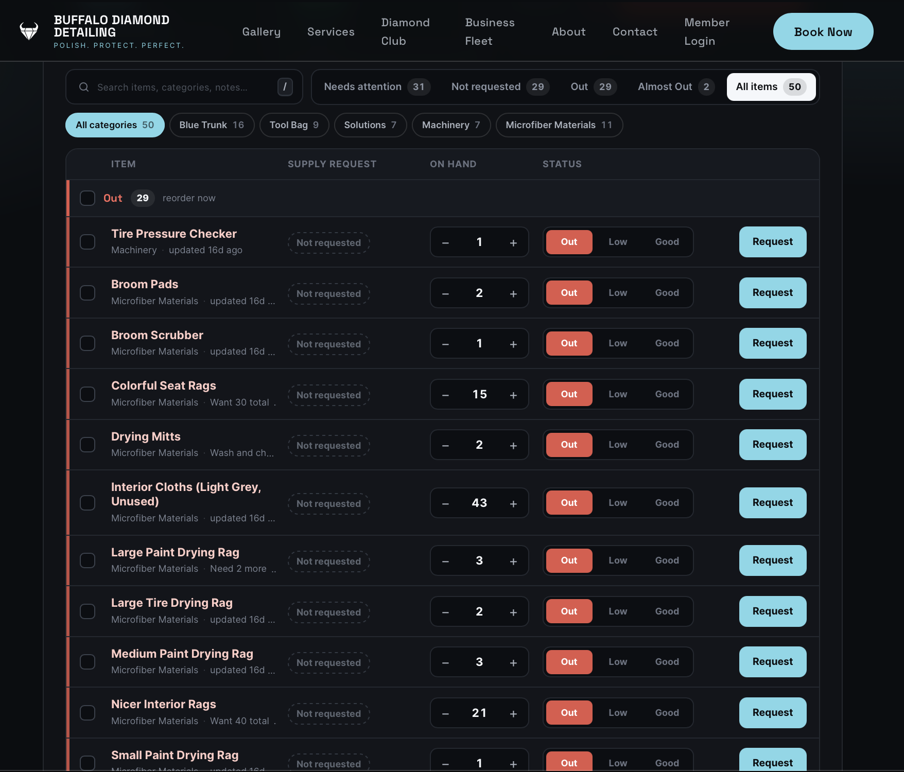
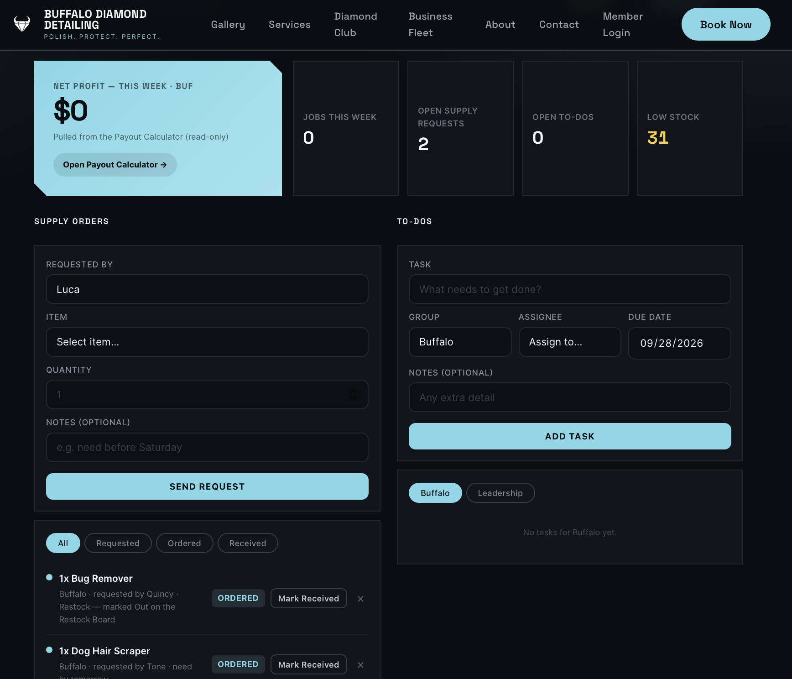

# Ops Tools — Portfolio Demo

> **This is a sanitized portfolio version of two production tools I built for a real two-location
> small business.** The business name, domain, city names, staff names, and inventory data have
> all been replaced with placeholders/fictional values. The architecture, logic, and code are
> unchanged from what's actually running in production. A private, unredacted copy exists and is
> available on request.

**Built by me, working with Claude (Anthropic) as an AI coding assistant** — I designed the
features, business logic, and architecture; Claude helped write and refine the code alongside me.
This repo's commit history covers the sanitization pass that produced this portfolio snapshot, not
the original build — happy to walk through how the real thing came together in an interview.

Two internal operations tools: a PHP API + vanilla JS frontend embedded as a WordPress Custom HTML
block, with a Slack bot layer for day-to-day use from the field.

## Payout Calculator (`payout-calculator/`)
Computes revenue splits per job across 9 job-type/staffing configurations (owners, on-site
manager, employees) plus a flat-rate mode, applies sales tax automatically, and tracks paid/unpaid
status per job across both locations. Owners can pull a live unpaid-payout summary from Slack with
`/payout`, and a scheduled script posts a weekly summary automatically.

## Command Center (`command-center/`)
Ops dashboard: supply-request approvals (Requested → Ordered → Received), live per-location
inventory, and shared to-do lists — plus a Slack bot (`bdd-slack.php`) with five slash commands
(`/supply-request`, `/stock`, `/inventory`, `/book`, `/payout`) so staff can do all of this without
opening a browser. `/book` creates real appointments in a third-party scheduling system
(LatePoint) directly from Slack. Two scheduled scripts post a daily ops digest and a weekly payout
summary automatically.

## Screenshots

> These are real screenshots of the live tool in production, including the real business name and
> team — unlike the code above, they haven't been sanitized. Numbers shown (net profit, stock
> counts, etc.) reflect whatever the tool's actual state was at the time of capture.

**Payout Calculator** — job entry, live splits, and the payout tracker:

**Command Center — Restock Board** — per-item stock status at a glance:

**Command Center — Inventory** — sortable, color-coded spreadsheet view:

**Command Center — Dashboard** — supply requests and to-dos:

## Security

- **Slack requests are cryptographically verified.** Every incoming Slack request is checked
  against Slack's documented signing algorithm: reject anything older than 5 minutes (replay
  protection), recompute an HMAC-SHA256 signature over the raw body using the app's signing
  secret, and compare it to Slack's `X-Slack-Signature` header with a constant-time comparison
  (`hash_equals`) so timing attacks can't leak the secret byte-by-byte. See
  `command-center/bdd-slack.php`.
- **API auth is a shared bearer token**, sent as an `X-BDD-Token` header and checked server-side
  before any read or write (`payout-calculator/bdd-api.php`,
  `command-center/bdd-supply-api.php`). This is intentionally simple rather than per-user —
  a known trade-off for a small internal tool, and the clearest place I'd add real user accounts
  and per-user tokens if this grew past a small team.
- **Role-based permissions gate the sensitive actions.** A Slack user's identity is resolved from
  their Slack member ID through an allowlist (`$BDD_SLACK_PEOPLE`); two further allowlists
  (`$PAYOUT_ALLOWED`, `$BOOK_OVERRIDE_ALLOWED`) restrict who can view financial payout data or
  book appointments outside normal open hours. Anyone not on the list is rejected before any
  business logic runs.
- **Known limitation:** the API token comparison in `bdd-supply-api.php` / `bdd-api.php` currently
  uses `!==` rather than `hash_equals()`. Low practical risk here since it's a single static
  token over HTTPS rather than a per-request signature, but it's the one spot I'd tighten first
  if this token model were extended.

---

**Note:** All API tokens, Slack tokens/secrets, webhook URLs, and Slack channel/member IDs in this
repo are placeholders — see each file's `define(...)` / `var TOKEN = ...` lines near the top. Real
values are kept outside version control. The `bdd-` prefix on filenames/functions is an internal
naming convention from the original project and isn't meaningful outside it.
